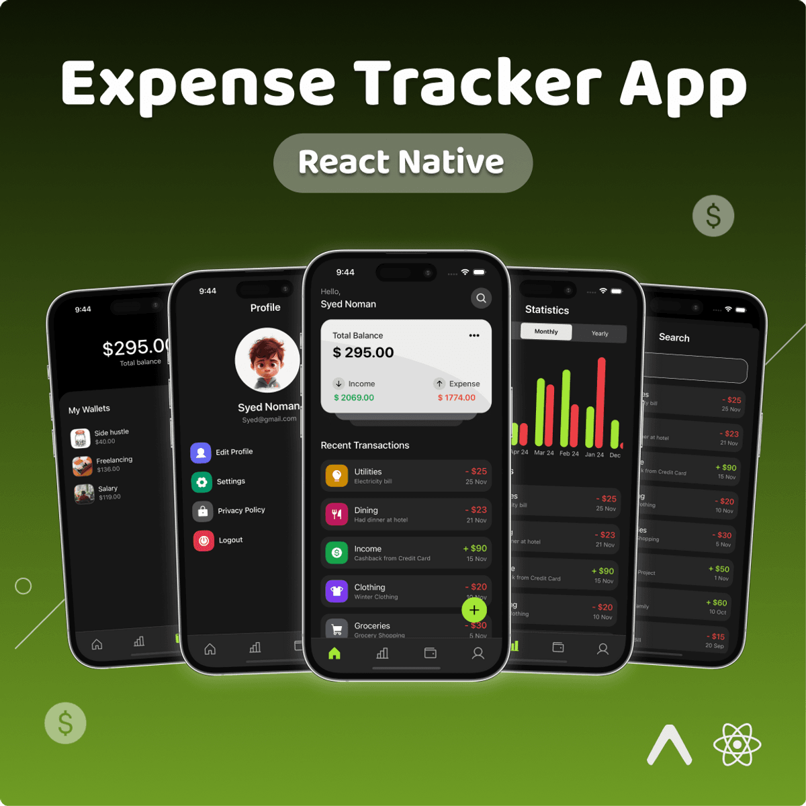

# 💰 Expense Tracker App

A modern, feature-rich expense tracking application built with React Native and Expo. Track your income and expenses, visualize your spending patterns with interactive charts, and manage your finances all in one place.



## ✨ Features

- 📊 **Dashboard** - View your total balance, recent transactions, and financial overview
- 💸 **Income & Expense Tracking** - Categorize and monitor all your transactions
- 📈 **Statistics** - Visualize your spending patterns with beautiful charts
- 🔍 **Search** - Quickly find specific transactions
- 👤 **User Profile** - Manage your account and settings
- 🎨 **Modern UI** - Clean, intuitive interface with smooth animations
- 🌙 **Dark Mode** - Eye-friendly dark theme

## 🛠️ Tech Stack

- **React Native** - Cross-platform mobile development
- **Expo** - Development platform and tools
- **TypeScript** - Type-safe code
- **Expo Router** - File-based routing
- **Firebase** - Backend services
- **Phosphor Icons** - Beautiful icon library

## 🚀 Getting Started

### Prerequisites

Before you begin, ensure you have the following installed:
- [Node.js](https://nodejs.org/) (v18 or higher)
- [npm](https://www.npmjs.com/) or [yarn](https://yarnpkg.com/)
- [Git](https://git-scm.com/)
- [Expo Go](https://expo.dev/go) app on your mobile device (for testing)

### 📋 Fork the Repository

1. Click the **Fork** button at the top right of this repository page
2. This creates a copy of the repository in your GitHub account

### 💾 Download and Install

#### Option 1: Clone Your Fork

```bash
# Clone your forked repository
git clone https://github.com/YOUR-USERNAME/expense-tracker.git

# Navigate to the project directory
cd expense-tracker

# Install dependencies
npm install
```

#### Option 2: Clone the Original Repository

```bash
# Clone the repository
git clone https://github.com/shubhamkumarsharma03/expanse-tracker.git

# Navigate to the project directory
cd expanse-tracker

# Install dependencies
npm install
```

### ▶️ Run the Project

1. **Start the development server:**

   ```bash
   npm start
   # or
   npx expo start
   ```

2. **Run on different platforms:**

   ```bash
   # Run on Android
   npm run android

   # Run on iOS (macOS only)
   npm run ios

   # Run on web
   npm run web
   ```

3. **Test on your device:**
   - Install **Expo Go** from the [App Store](https://apps.apple.com/app/expo-go/id982107779) or [Google Play](https://play.google.com/store/apps/details?id=host.exp.exponent)
   - Scan the QR code from your terminal with:
     - **iOS**: Camera app
     - **Android**: Expo Go app

### 🔧 Available Scripts

- `npm start` - Start the Expo development server
- `npm run android` - Run on Android emulator/device
- `npm run ios` - Run on iOS simulator/device
- `npm run web` - Run in web browser
- `npm run lint` - Run ESLint for code quality
- `npm run reset-project` - Reset to a fresh project

## 📱 Development

This project uses [Expo Router](https://docs.expo.dev/router/introduction/) for navigation with file-based routing. 

- Edit files in the `app/` directory to start developing
- Components are in the `components/` directory
- Constants and theme settings are in the `constants/` directory
- Utility functions are in the `utils/` directory

## 🤝 Contributing

Contributions are welcome! Here's how you can help:

1. Fork the repository
2. Create a new branch (`git checkout -b feature/amazing-feature`)
3. Make your changes
4. Commit your changes (`git commit -m 'Add some amazing feature'`)
5. Push to the branch (`git push origin feature/amazing-feature`)
6. Open a Pull Request

## 📄 License

This project is open source.


## 🙏 Acknowledgments

- Built with [Expo](https://expo.dev)
- Icons by [Phosphor Icons](https://phosphoricons.com/)
- Inspired by modern finance apps

## 📚 Learn More

To learn more about the technologies used in this project:

- [Expo Documentation](https://docs.expo.dev/)
- [React Native Documentation](https://reactnative.dev/)
- [Expo Router Documentation](https://docs.expo.dev/router/introduction/)
- [Firebase Documentation](https://firebase.google.com/docs)

---

Made with ❤️ by [Shubham Kumar Sharma](https://github.com/shubhamkumarsharma03)
